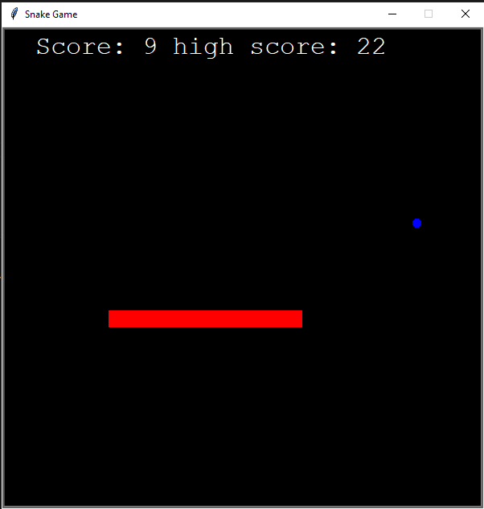

# The classic Snake game using turtle graphics

## The game was part of a python course i was doing. It was a project in the course.

### How to run the game:

- Clone or download this repository to your local machine.
- Make sure you have Python installed.
- Run main.py to start the game.

### How to play the game:

- Control the snake using arrow keys: up, down, left, and right.
- Eat the food that pops up on the screen to gain 1 point for each food.
- Watch the snake grow longer as you eat more food.
- Your score and high score are displayed at the top.
- If you make a new high score, your new high score will replace the old one and will be displayed at the top.
- If you hit the screen edges or your own tail, it's game over.
- After game over a new game begins automatically and the snake will return to its original small size.

